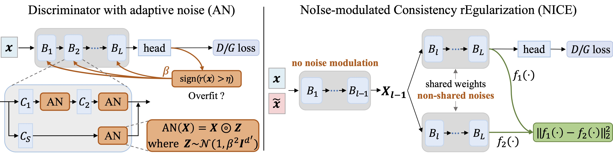

<br />
<p align="center">
    <h1 align="center">
        NICE: NoIse-modulated Consistency rEgularization for Data-Efficient GANs
    </h1>
    <p align="center">
    
  </p>

  <p align="center">
    <strong>NeurIPS 2023</strong>
    <br />
    <a href="https://scholar.google.com/citations?user=oGD-WMQAAAAJ&hl=en"><strong>Yao Ni </strong></a>
    ,
    <a href="https://users.cecs.anu.edu.au/~koniusz/"><strong>Piotr Koniusz</strong></a>
  </p>
  
  <p align="center">
    <a href='https://openreview.net/forum?id=YFW6MVGVTn'>
      
    </a>
    <a href='https://nips.cc/virtual/2023/poster/71306'>
      
    </a>
  </p>
</p>
<br />

## Simple Code Example

## Full Code will come soon...

## Citation

If you use the theories or code for your research, please cite with the below:
```
@inproceedings{
    ni2023nice,
    title={{NICE}: NoIse-modulated Consistency rEgularization for Data-Efficient {GAN}s},
    author={Yao Ni and Piotr Koniusz},
    booktitle={Thirty-seventh Conference on Neural Information Processing Systems},
    year={2023},
    url={https://openreview.net/forum?id=YFW6MVGVTn}
}
```
